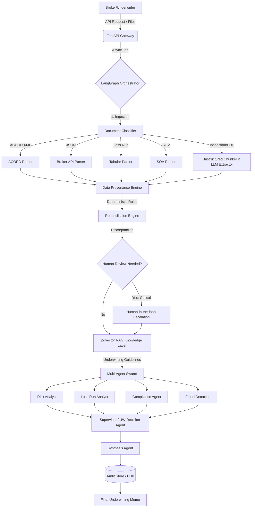

# InsureFlow AI - System Design Architecture

## 1. System Overview
InsureFlow AI is an enterprise-grade, autonomous agentic pipeline designed to handle commercial underwriting data ingestion, deterministic reconciliation, and decision synthesis. It processes multi-modal inputs (structured XML/JSON, tabular SOVs/Loss Runs, and unstructured PDFs), resolves discrepancies using a strict legal data provenance hierarchy, enforces proprietary underwriting guidelines via RAG, and outputs a synthesized risk profile and underwriting decision memo.

---

## 2. High-Level Architecture Diagram

---

## 3. Core Components

### 3.1 Network & API Layer
- **Component:** `insureflow/api.py`
- **Description:** A FastAPI microservice utilizing `BackgroundTasks` to handle long-running LLM and OCR operations asynchronously. It provides non-blocking endpoints that instantly return a `job_id` for tracking.

### 3.2 Multi-Modal Ingestion Engine
- **Component:** `insureflow/ingestion/`
- **Description:** Responsible for safely parsing various data formats.
  - **DocumentClassifier:** Uses Regex/heuristics to automatically route files to the correct parser.
  - **Structured Parsers:** ACORD XML and JSON Broker API parsers map standard inputs directly to Pydantic domain models.
  - **Tabular Parsers:** SOV and Loss Run parsers extract complex historical claims and location schedules.
  - **Document Chunker:** Safely splits massive unstructured texts (50-150 pages) into overlapping chunks to prevent LLM context-window exhaustion and OOM errors.

### 3.3 Orchestration (LangGraph State Machine)
- **Component:** `insureflow/graph/builder.py`, `insureflow/graph/nodes.py`
- **Description:** Replaces linear execution with a robust state graph. It manages conditional routing, automatic retries for failed LLM extractions (up to 3 times), and explicit escalations to human review queues for critical data discrepancies.

### 3.4 Data Provenance & Reconciliation
- **Component:** `insureflow/provenance/`, `insureflow/reconciliation/`
- **Description:** The deterministic "source of truth" layer. It assigns Trust Levels based on a strict legal hierarchy (e.g., *Signed Legal Submission* > *Broker ACORD XML* > *AI Extracted PDF*). If an AI guess contradicts a structured broker fact, the system deterministically overrides the AI and flags a discrepancy, eliminating hallucinations on critical limits.

### 3.5 RAG Knowledge Layer
- **Component:** `insureflow/agents/rag_agent.py`, `PostgreSQL/pgvector`
- **Description:** Converts the risk profile (Construction, Occupancy, etc.) into vector embeddings and queries a `pgvector` database to retrieve proprietary underwriting guidelines (e.g., "Decline ammonia refrigeration without secondary containment").

### 3.6 Multi-Agent Swarm (ReAct Framework)
- **Component:** `insureflow/agents/`
- **Description:** A suite of specialized LLM agents utilizing the ReAct (Reasoning and Acting) framework with specific underwriting tools.
  - **Risk Analyst:** Assesses physical property characteristics (Construction, Protection Class).
  - **Loss Run Analyst:** Evaluates claim frequency, severity, and trends.
  - **Compliance Agent:** Verifies coverage adequacy and sublimits against TIV.
  - **Fraud Detection:** Detects non-disclosed claims and valuation mismatches.
  - **UW Decision Agent:** Aggregates findings and makes a final "Accept, Refer, or Decline" decision.

### 3.7 Audit & Observability Layer
- **Component:** `insureflow/audit/logger.py`, `insureflow/audit/store.py`
- **Description:** Provides absolute transparency. Emits standard infrastructure logs for monitoring (Datadog/Splunk) and persists detailed, immutable JSON trails of every LLM decision, provenance node, and reconciliation step to local disk (or cloud storage).

---

## 4. Execution Flow

1. **Trigger:** Broker submits ACORD XML and an Inspection PDF to `/pipeline/run`.
2. **Ingest & Chunk:** The API assigns a `job_id`, classifies the documents, parses the XML to Pydantic, and chunks the PDF.
3. **Extract:** LLM extracts unstructured fields from the PDF chunks.
4. **Provenance Check:** The Provenance Engine maps both data sources. Conflict occurs (e.g., XML says $5M limit, PDF says $6M).
5. **Reconcile:** The Reconciliation engine deterministically chooses the XML value (higher trust rank) and logs a discrepancy.
6. **RAG Lookup:** The system embeds the location data and pulls relevant rules from `pgvector`.
7. **Agent Swarm:** Specialist agents review the reconciled data and RAG rules, returning findings.
8. **Synthesis:** The UW Decision agent outputs a final memo (Accept/Decline + rationale).
9. **Audit:** All states, artifacts, and decisions are written to the Audit Store.

---

## 5. Technologies Used
- **Core Language:** Python 3.12+
- **API Framework:** FastAPI, Uvicorn
- **State Machine / Orchestration:** LangGraph, LangChain Core
- **Data Modeling & Validation:** Pydantic
- **LLM Integration:** OpenAI (GPT-4o), Anthropic (Claude), vLLM (Local Quantized Models)
- **Vector Database:** PostgreSQL 17 + pgvector (via psycopg2)
- **Containerization:** Docker, Docker Compose