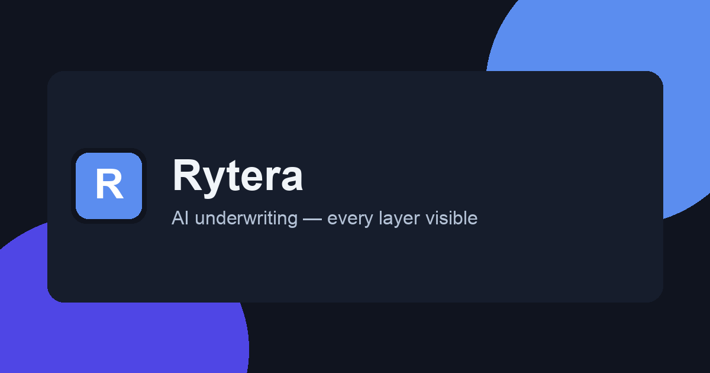
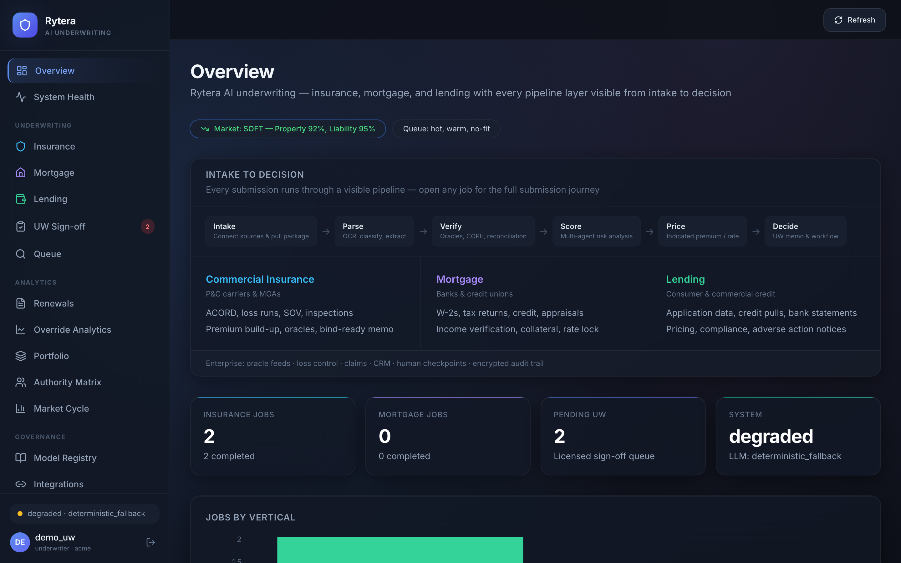
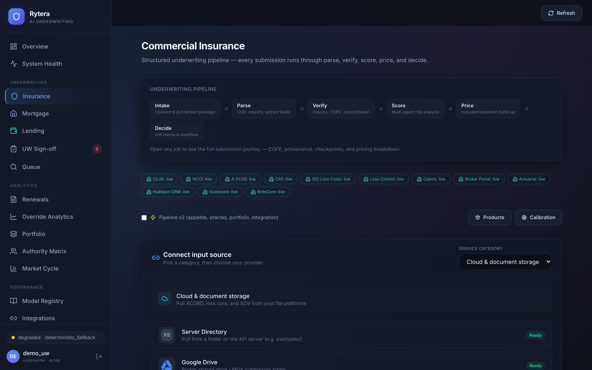
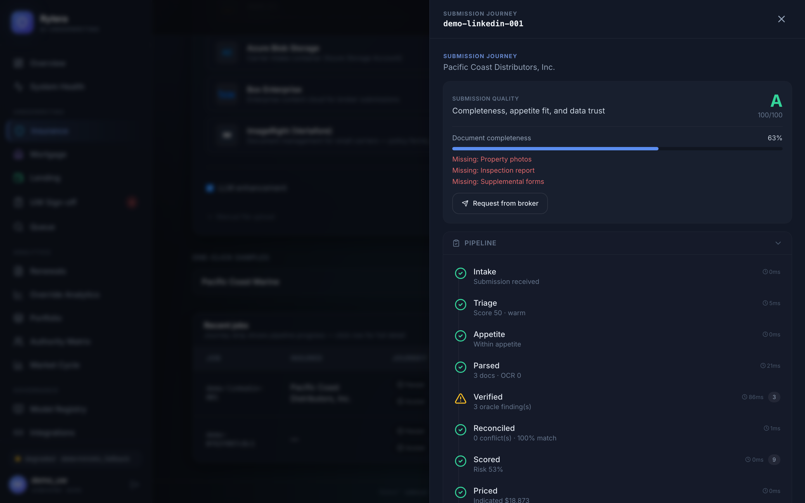
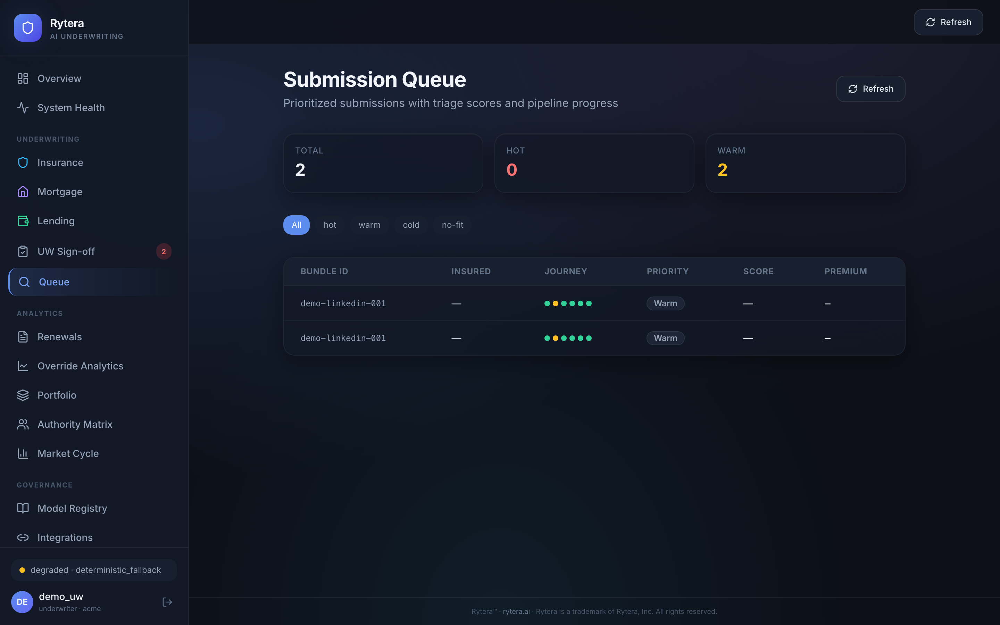

# Rytera — Application Guide

**PDF:** [PRODUCT_GUIDE.pdf](./PRODUCT_GUIDE.pdf) — designed shareable version (regenerate with `scripts/marketing/build_product_guide_pdf.py`)

---

## What Rytera is

**Underwriting you can inspect.** Rytera is an AI underwriting workbench for **commercial insurance**, **mortgage**, and **lending**. It takes a messy submission package, runs specialist agents and data oracles, and returns a structured recommendation — decision, findings, and pricing indication — for a **licensed human** to accept, override, or refer.

It does **not** silently bind. In pilot / shadow mode, analysis and UW sign-off stay on; live bind stays off until your PAS and policy allow it.

**Pilot targets:** time-to-first UW review &lt; 15 min · override rate &lt; 25% by day 30 · fail-closed when required feeds are missing.

**Live product:** [ryterainc.com](https://ryterainc.com/) · **Dashboard:** [ryterainc.com/dashboard](https://ryterainc.com/dashboard)



---

## Who it’s for

| Audience | Why they open Rytera |
|----------|----------------------|
| Carrier / MGA underwriters | Faster first pass on commercial packages without a black box |
| Pilot / product owners | Shadow-run real (redacted) book and measure override rate |
| Ops / risk | Audit trail, PII redaction, fail-closed when required feeds are missing |

---

## How a submission moves

Every vertical follows the same spine:

**Intake → Parse → Verify → Score → Price → Decide → HITL → (optional) Bind**

| Stage | In practice |
|-------|-------------|
| **Intake** | Upload, folder drop, email/IMAP, S3, or one-click demos |
| **Parse** | ACORD / loss runs / SOV / inspections (or mortgage & lending docs) classified and extracted |
| **Verify** | Cross-document reconciliation + oracles (CLUE, A-PLUS, NCCI, CAT when keyed) |
| **Score** | Risk, loss-run, compliance, fraud, and vertical-specific agents |
| **Price** | Indicated premium, rate lock, or loan pricing |
| **Decide** | Accept / conditional / refer / decline (or mortgage & lending equivalents) |
| **HITL** | Licensed UW sign-off with notes and override reasons |
| **Bind** | Optional; blocked in shadow / pilot until PAS is live |

---

## What to show in a demo

Use the **marketing site** for story; use the **dashboard** for proof.

### 1. Overview — start here



Dashboard home: job counts by vertical, market-cycle context, queue pulse, one-click demos, and recent insurance journey strips. Best first screen when someone asks “what’s running?”

### 2. Insurance workspace — run a package



Commercial P&C workbench: sample submissions, custom packages, job table with journey mini-strips. From a row you open the full submission journey.

### 3. Submission journey — the “no black box” screen



One file, end to end: intake → decision, COPE / oracles / reconciliation, UW memo, pricing build-up, visual analysis when photos exist, quote and report downloads. This is the screen for underwriters and auditors.

### 4. Queue — where time goes



Prioritized queue with fit / triage scores and journey strips so UW attention hits the hottest files first.

### 5. Pilot Lab & UW sign-off

- **Pilot Lab** (`/pilot`) — sandbox readiness (CLUE / A-PLUS / Guidewire / Redis), redacted package runs, PII auto-redact, email ingest, outreach drafts.
- **UW Sign-off** (`/workflow`) — human approve / refer / decline with notes; pending badges in the nav.

---

## The rest of the sidebar (when you need it)

| Area | Purpose |
|------|---------|
| System Health | LLM, job store, encryption — healthy / degraded / missing (no secrets) |
| Mortgage / Lending | Upload packages (or demos); stage strips and loan decisions; mortgage PII masked before LLM / storage |
| Renewals | Pre-renewal / premium audit tracking |
| Override Analytics | UW vs AI — pilot KPI (target override &lt; 25% by day 30) |
| Eval Trends | Quality / release-gate trends over time |
| Portfolio | Book / concentration context |
| Authority Matrix | Who can bind; co-sign thresholds |
| Market Cycle | Hard / soft phase → appetite and premium modifiers |
| Model Registry | Agent / experiment governance |
| Integrations | Oracle & PAS modes: live / simulated / auto |
| Webhooks | HMAC callbacks when jobs complete |
| Settings | Org / session preferences |
| Broker status | Lightweight share link when enabled |

---

## Decisions you’ll see

| Vertical | Outcomes |
|----------|----------|
| Insurance | `ACCEPT` · `CONDITIONAL_ACCEPT` · `REFER` · `DECLINE` |
| Mortgage | Approve / Refer / Suspend / Deny + rate |
| Lending | Approved / conditions / referred / declined / suspended |

Shadow pilot: full analysis + sign-off. **Live bind stays blocked** until you wire PAS and turn it on.

---

## Trust built into the product

- JWT roles: admin / underwriter / viewer  
- Org-scoped jobs  
- PII detection and redaction for pilots  
- Encrypted audit bundles + SHA-256 regulatory ZIP exports  
- Fail-closed when required data or oracles are missing in hardened mode  

---

## Ten-minute demo script

1. Open [dashboard](https://ryterainc.com/dashboard) and sign in  
2. **Overview** → run an insurance demo  
3. **Insurance** → open the job → walk the **submission journey**  
4. **Queue** → show triage order  
5. **Pilot Lab** → sandbox readiness + shadow mode  
6. Optional: **UW Sign-off** → human override path  

---

## Related docs

| Doc | Purpose |
|-----|---------|
| [PILOT_PARTNER_BRIEF.md](./PILOT_PARTNER_BRIEF.md) | What to ask a carrier / MGA |
| [../outreach/THIS_WEEK_OUTREACH.md](../outreach/THIS_WEEK_OUTREACH.md) | Email templates |
| [../ops/ORACLE_LIVE_WIRING.md](../ops/ORACLE_LIVE_WIRING.md) | Live CLUE / A-PLUS keys |
| [../architecture/architecture.md](../architecture/architecture.md) | Technical design |
| [../../STRUCTURE.md](../../STRUCTURE.md) | Repo map |

---

## Regenerating the PDF & screenshots

```bash
# PDF (Chrome / Playwright):
python scripts/marketing/build_product_guide_pdf.py

# Screenshots (API on :8002 + Playwright):
PYTHONPATH=src python scripts/marketing/build_linkedin_deck.py
# Then copy new PNGs into docs/product/screenshots/
```
